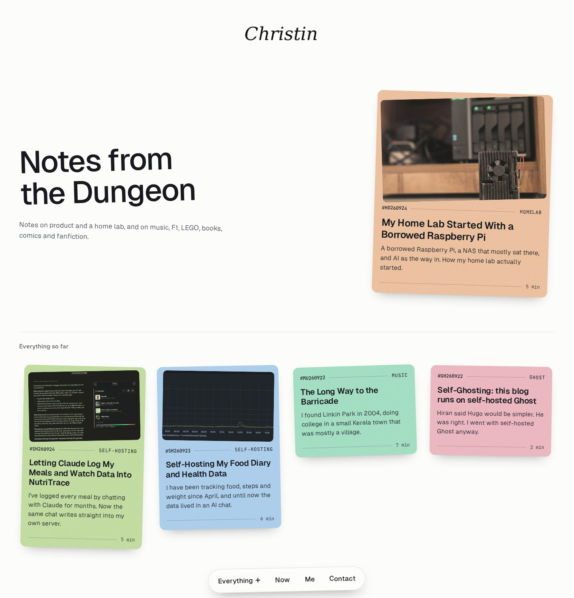
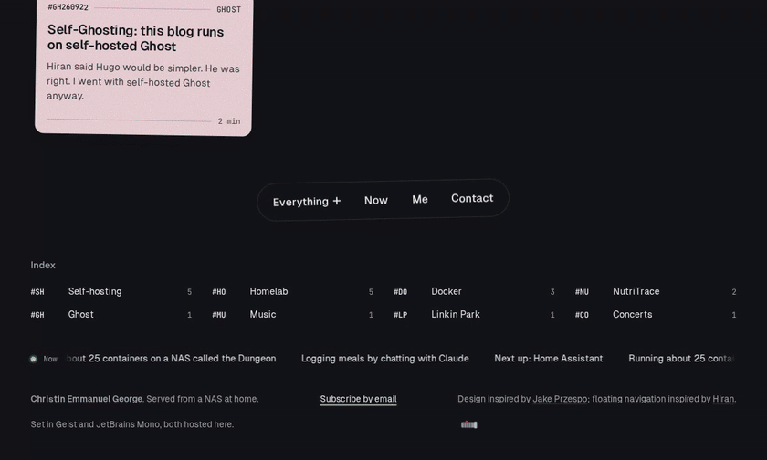
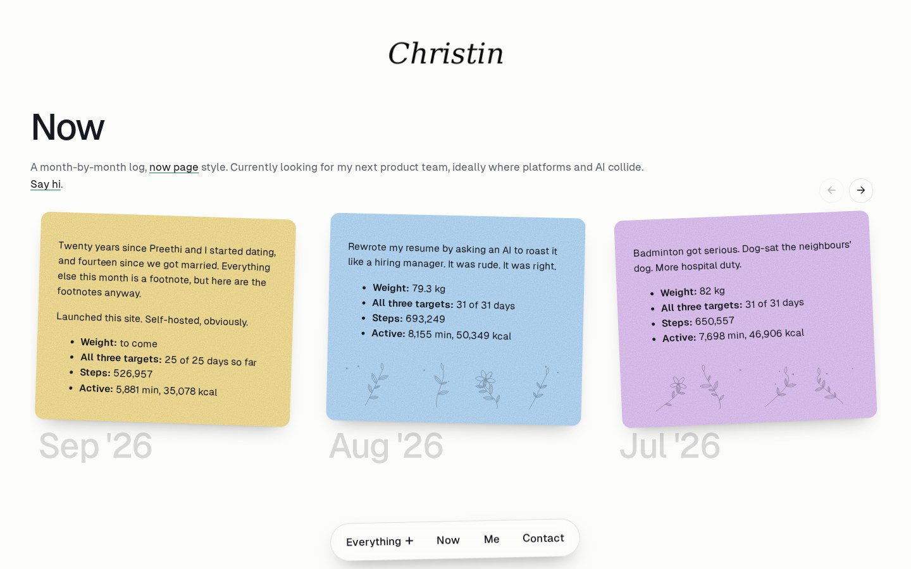
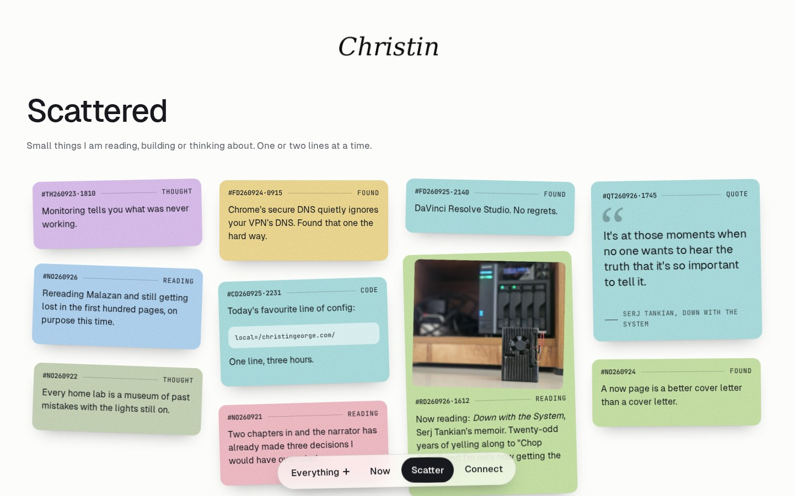
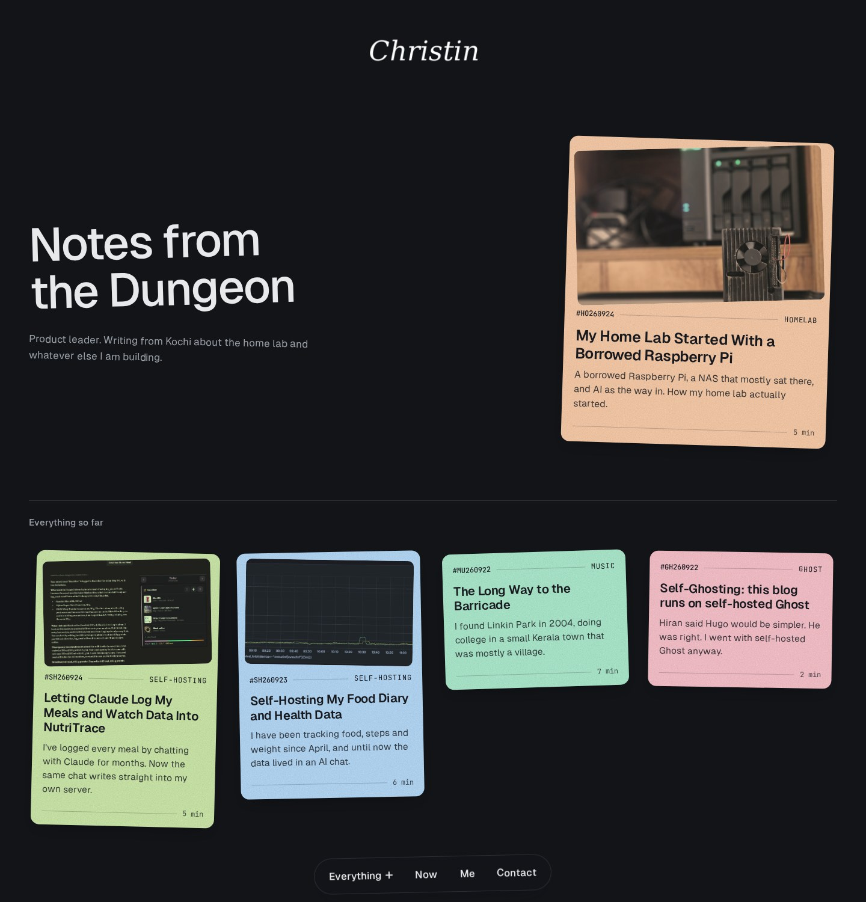
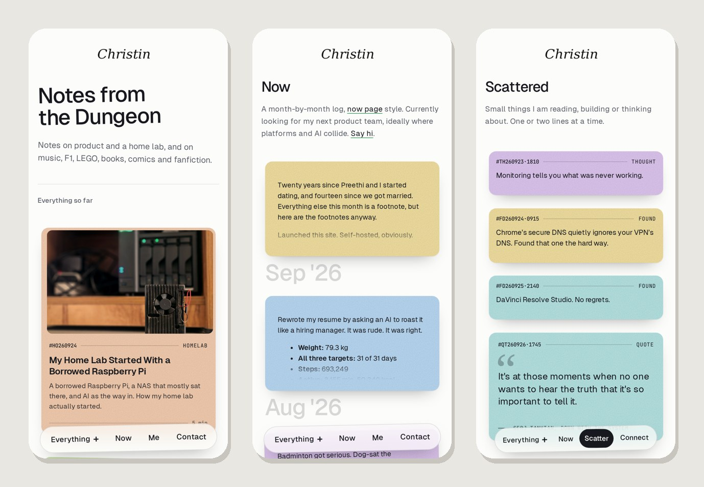

# Dungeon

A playful theme for [Ghost](https://ghost.org). Posts sit on the page as pastel index cards, each tilted at its own slight angle and stamped with a filing code. There's a floating menu, a month-by-month **Now** page, a **Scatter** wall of short notes, and a lightsaber in the footer that switches between light and dark.

**[See the live demo](https://dungeon-demo.pages.dev)**, with sample content that shows every feature.

Version 1.0.4. Works with Ghost 5 and 6. Built for [christingeorge.com](https://christingeorge.com).

  

## Features

- **Index-card homepage.** Grainy pastel cards, each at a stable angle. Hovering straightens a card and brings its image's colour back. On phones, cards gain colour as they scroll into view.
- **Filing codes.** Every post gets a code from its primary tag and date, such as `#HO260924` for a Homelab post on 24 September 2026.
- **Reader overlay.** Posts open over the homepage in a panel; direct links still work as normal pages.
- **Floating menu.** A pill at the bottom of the screen that hides while you scroll down on phones, rests above the footer at the end of a page, and adapts to narrow screens.
- **Now page.** Monthly updates as cards that fill the screen's height, arrive one by one, and nudge sideways to show there's more. Empty space in a card can hold an etched pattern.
- **Scatter wall.** One- or two-line notes: thoughts, quotes, song lyrics with a play button, reading notes, code snippets. They drop in one by one as you scroll.
- **Lightsaber switch.** A glowing blade in the footer. Clicking it switches between light and dark mode over two seconds, with the new mode spreading out in a circle edged with crackling static. Optional synthesised sound.
- **Light, dark or automatic** colour scheme, and a remembered choice per visitor.
- **Calm when asked.** Every animation respects the visitor's reduced-motion setting.
- **Privacy-minded.** Fonts are hosted by the theme. YouTube embeds show a thumbnail and only load YouTube's no-cookie player when a visitor presses play.
- **Translatable.** All interface wording goes through Ghost's translation helper.

## Screenshots

| Now page | Scatter wall |
|---|---|
|  |  |

| Dark mode | On a phone |
|---|---|
|  |  |

## Installation

1. Download **`dungeon.zip`** from the [latest release](../../releases/latest). Keep that file name: Ghost names the theme after the zip, and theme settings belong to that name, so an update uploaded as `dungeon.zip` overwrites the theme and keeps your settings.
2. Ghost Admin → **Settings → Design & branding → Change theme → Upload theme**, choose the zip, and activate it.
3. Optional, but needed for the Now page and Scatter wall: upload [`docs/routes.yaml`](docs/routes.yaml) in **Settings → Labs → Routes**. Download your current file first as a backup.

## Theme settings

Found in **Settings → Design & branding → Customise**.

| Setting | What it does |
|---|---|
| **Role line** | A short line under the homepage statement, for example what you do. Hidden when empty. |
| **Now items** | A ticker in the footer. Separate items with `\|`. Hidden when empty. |
| **Color scheme** | Auto (follows the visitor's device), Light or Dark. The saber switch overrides it per visitor. |
| **Card tilt** | None, Subtle, Playful or Wild. |
| **Hero card** | Shows the newest post as a large card beside the homepage statement on desktop. |
| **Show index** | A list of your tags, with post counts, in the footer. On phones it shows the top six, with "+N more". |
| **Logo invert dark** | Inverts a dark logo so it shows on the dark scheme. |
| **List heading** | A heading above the post list. Hidden when empty. |
| **Floating nav** | The floating menu. Off puts navigation back under the logo. |
| **Footer name** | The name in the footer. Defaults to the site title. |
| **Footer note** | A short line after the name in the footer. Hidden when empty. |
| **Footer line two** | A second footer line, bottom left: your fonts, a note, anything. Hidden when empty. |
| **Show credit** | The design credit in the footer. Switch it off if you prefer. |
| **Now filler** | The pattern drawn in empty space on Now cards: Floral, Circuit board, Cityscape, Topographic or None. |
| **Scheme switch** | The lightsaber light/dark switch in the footer. |
| **Saber light message** | Text shown briefly when switching to light mode. |
| **Saber dark message** | Text shown briefly when switching to dark mode. |
| **Saber sound** | A synthesised saber sound on switching. Off by default. It only ever plays when a visitor clicks the saber. |

## Navigation

Set the links in **Settings → Navigation**.

- **Primary** links appear in the floating menu. Four or five short labels fit comfortably.
- **An "Everything" menu:** add a primary item whose URL is `#everything`, with any label. It opens a small panel above the menu holding your **Secondary** links. When it's set up, secondary links are shown only there, not in the footer.
- **Narrow screens:** if the menu doesn't fit, the theme first tightens its spacing, then moves items into the Everything panel (keeping the last item, such as Contact, visible), and as a last resort shrinks Everything to a `+`.

## Now page

1. Create a page with the URL **`now`**. Its body becomes the intro above the timeline.
2. Each month is a post with the internal tag **`#now`**. Its publish date sets the month label (for example **Sep '26**). The title isn't shown.
3. Clicking a month opens it in the overlay. A feature image appears at the top of the card.
4. **Pattern for one month:** add one of `#filler-floral`, `#filler-circuit`, `#filler-city`, `#filler-topo` or `#filler-none`. It overrides the **Now filler** setting for that month.
5. **Colour for one month:** add a colour tag (see [Colours](#colours)). Otherwise each month gets a colour automatically.

The page shows the latest 60 months.

## Scatter wall

1. Create a page with any title and URL, then pick the **Scattered** template in its settings. Its body becomes the intro.
2. Each note is a post with the internal tag **`#note`**. The title isn't shown (except on quotes and lyrics, below).
3. **Kind** (optional, sets the card's label and code prefix):

| Tag | Label | Code |
|---|---|---|
| `#thought` | Thought | `#TH260926·1745` |
| `#reading` | Reading | `#RD…` |
| `#code` | Code | `#CD…` |
| `#found` | Found | `#FD…` |
| `#quote` | Quote | `#QT…` |
| `#lyric` | Lyric | `#LY…` |
| none | none | `#NO…` |

4. **Quotes and lyrics:** the body is the quote, and the **title is the attribution** (for example `Author, Book`). Paste a YouTube or YouTube Music link in the body and it becomes a play button that opens a small player in the card.
5. **Colour** (optional): see [Colours](#colours).
6. A **feature image** appears at the top of the card and zooms out past it on hover.

The wall shows the latest 100 notes, newest first, packed into columns.

When publishing Now entries and notes, choose **Publish only**, so they aren't emailed to newsletter subscribers.

## Colours

Add one of these internal tags to a Scatter note or a Now month to fix its colour:

- **Pastels:** `#pistachio` `#mint` `#sky` `#periwinkle` `#lilac` `#blush` `#peach` `#butter` `#sage` `#seafoam`
- **Bold:** `#red` `#tangerine` `#sunflower` `#cobalt` `#emerald` `#ink` (text and patterns switch to white automatically)

## Tables and a Colophon page

Tables in posts and pages are styled as clean rows, with the first column as the label and the rest quieter. Two-column Markdown tables with an empty header row show no header at all. On a page with the URL **`colophon`**, level-4 headings (`####`) become small uppercase section labels, handy for a "how this site is made" page.

## routes.yaml

[`docs/routes.yaml`](docs/routes.yaml) keeps `#now` and `#note` posts off your homepage, so they appear only on their own pages. The theme also skips them on the homepage as a safety net.

## The demo site

The [demo](https://dungeon-demo.pages.dev) is rebuilt automatically after every release: GitHub starts a throwaway Ghost, installs the new theme, loads the sample content in [`demo/content.json`](demo/content.json), and publishes a static copy to Cloudflare Pages. Static means search, sign-ups and comments are switched off there; everything else is exactly what you'd install. The build lives in [`demo/build.mjs`](demo/build.mjs).

## Translations

Copy `locales/en.json` to a file named after your language (for example `locales/de.json`), translate the values, and set your site's language in **Settings → General**.

## Known limitations

- A few labels created by the theme's script (such as the Index's "+N more" and the music player's "Play" and "Stop") are English only.
- The Now page shows up to 60 months and the Scatter wall up to 100 notes.
- The circular colour-mode reveal needs a browser with View Transitions; others get a smooth two-second colour blend instead.

## Credits

- Design inspired by [Jake Przespo](https://www.jake.design/).
- Floating navigation inspired by [Hiran Venugopalan](https://hiran.in).
- Fonts: [Geist](https://vercel.com/font) and [JetBrains Mono](https://www.jetbrains.com/lp/mono/), both under the SIL Open Font License (licences in `assets/fonts`).

## Licence

MIT. See [LICENSE](LICENSE).
